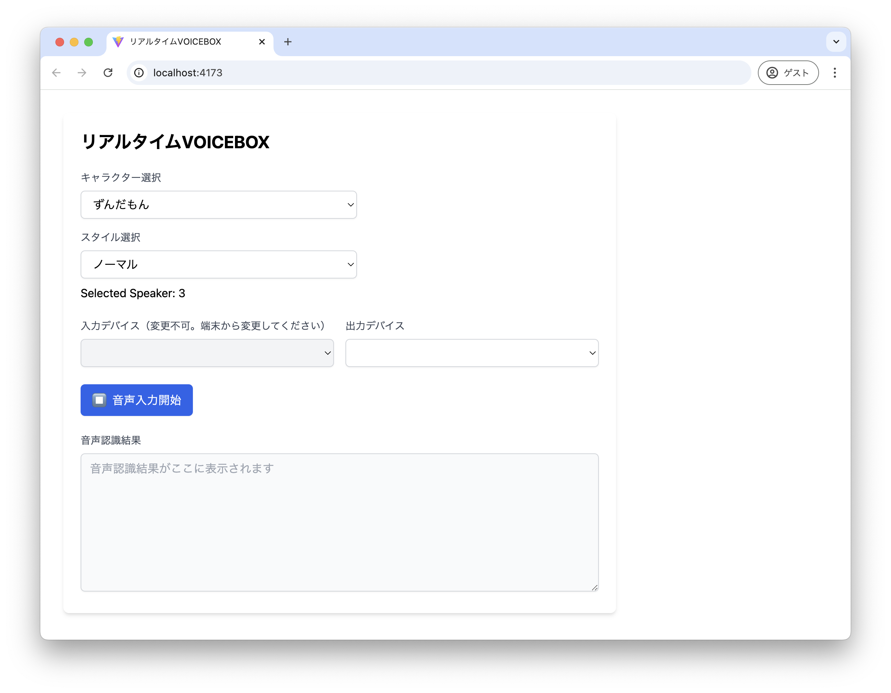
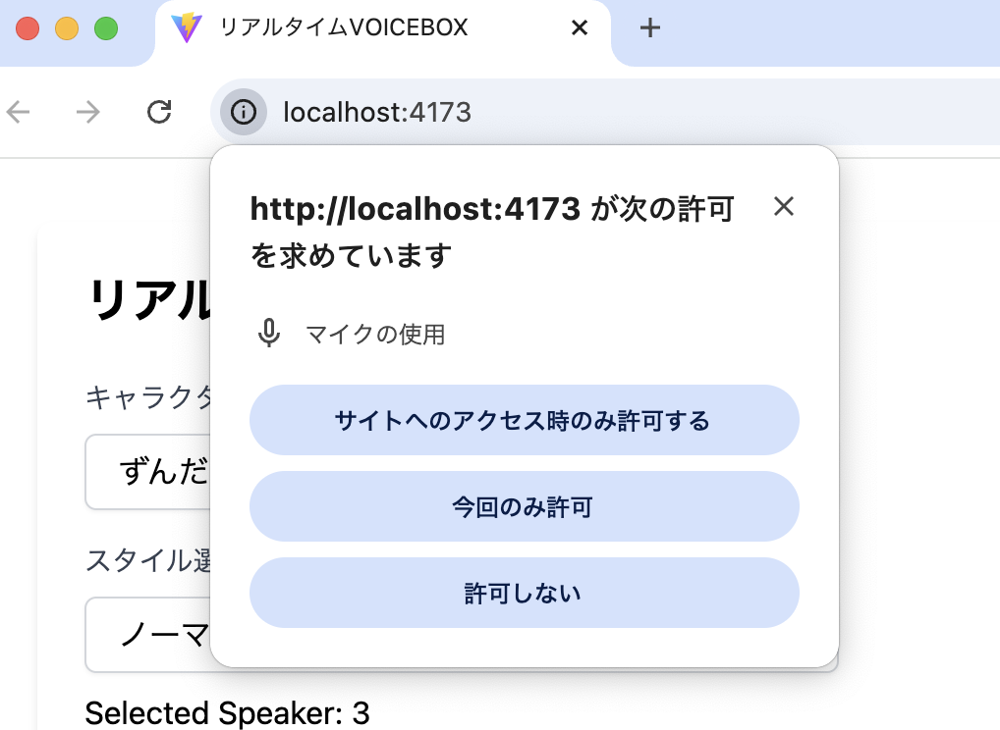

# リアルタイムVOICEBOX
Web Speech APIとVOICEBOXを利用したリアルタイム音声変換ツールです  
音声認識はWeb Speech APIに依存しているため精度はあまり高くありません。

### 必須ツール
- [VOICEBOX（事前に起動しておく必要があります）](https://voicevox.hiroshiba.jp/)
- Node.js v22以上

### 使い方
ローカルからwebアプリを起動して利用します

```bash
# 事前にVOICEBOXを起動

# セットアップ
npm install

# webアプリ起動
npm run preview
open http://localhost:4173/
```

### 音声認識のポイント
- 連続で喋ると上手く音声認識できません。一度VOICEVOXの音声が終わってから話してください
- はっきりハキハキと喋ると音声認識の精度が高くなります
- 疑問文や感嘆符のあるような音声の認識が難しいです（Web Speech APIの進化で改善する可能性はあるかも。。）
- 何度喋っても認識しない場合は音声入力を停止するか画面をリロードしてください

### 画面の使い方
1. キャラクター選択後、スタイルも選択してください。Selected Speakerの値でボイスが決まります
2. 入力デバイスはブラウザ側から変更できないので端末（PC、スマホ）から変更してください
3. 出力デバイスを選択してください
4. 音声入力開始ボタンを押してください
5. 終了する場合は再度音声入力停止ボタンを押してください




### 利用規約
- このプロジェクトは基本的に[MIT License](LICENSE)に準拠します
  - GitHubへのリンクやツール名の記載は特に不要です。自由に使ってください
- VOICEVOXの利用については[VOICEVOX ソフトウェア利用規約](https://voicevox.hiroshiba.jp/term/)に準じてください

### FAQ
- Q1. 入力デバイス、出力デバイスが表示されません。
  - ブラウザからマイクの入力を許可してください
    
- Q2. 入力デバイスが選択できません
  - Web Speech APIの仕様上、ブラウザ側でマイクを選択できないのでお使いの端末（PC、スマホ）から変更してください
- Q3. 「キャラクターの取得に失敗しました。VOICEBOX APIの接続に失敗しました。」と表示されます
  - VOICEVOXの起動が必要です。[公式サイト](https://voicevox.hiroshiba.jp/)からDLして起動してください。
    ※VOICEOBOX APIのポートを変更している場合はデフォルトポートの50021を指定してください


## 開発者向け

### Usage

```bash
# webアプリ起動
npm run dev
open http://localhost:5173/
```

### 使用言語・環境
- React v18
- Node.js v22
- Vite v6
- TypeScript v5.6
- Tailwind CSS v3

## ディレクトリ構成

```
.
├── README.md
├── docs              ...ドキュメント置き場
├── public            ... 外部公開したい静的ファイル配置。favicon,robots.txt等
├── src               ... ソースディレクトリ
│   ├── assets        ... 画像、フォント等の静的ファイル置き場。基本はpublicではなくこちらを使用
│   ├── components    ... UIコンポーネント置き場。基本的にはtsxファイルのみ配置
│   ├── hooks         ... 外部データの保存やstate管理したい場合はカスタムフックを利用
│   ├── services      ... 外部APIとの通信やビジネスロジックをここに配置
│   └── types         ... 型定義ファイル置き場
```
